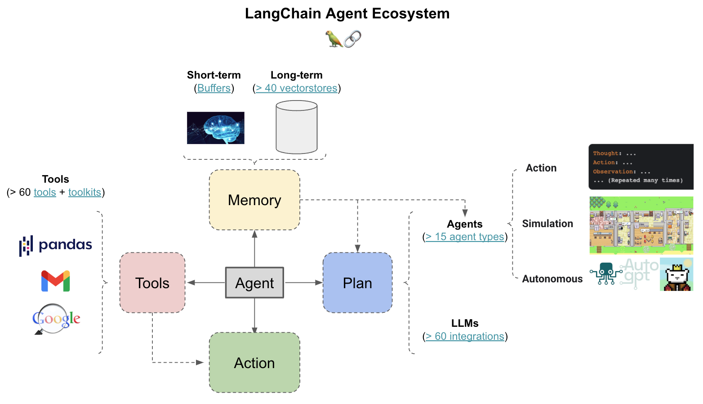
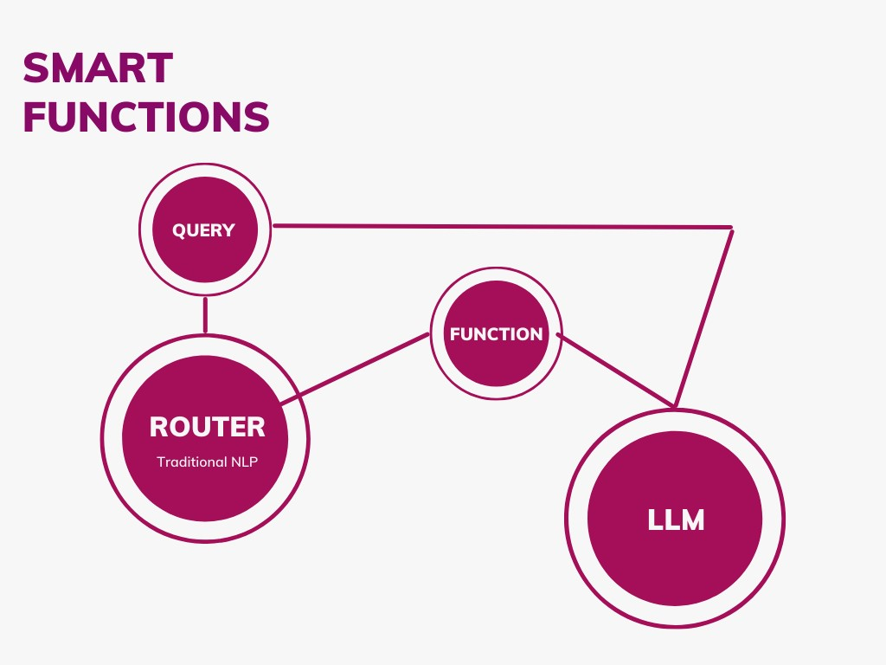
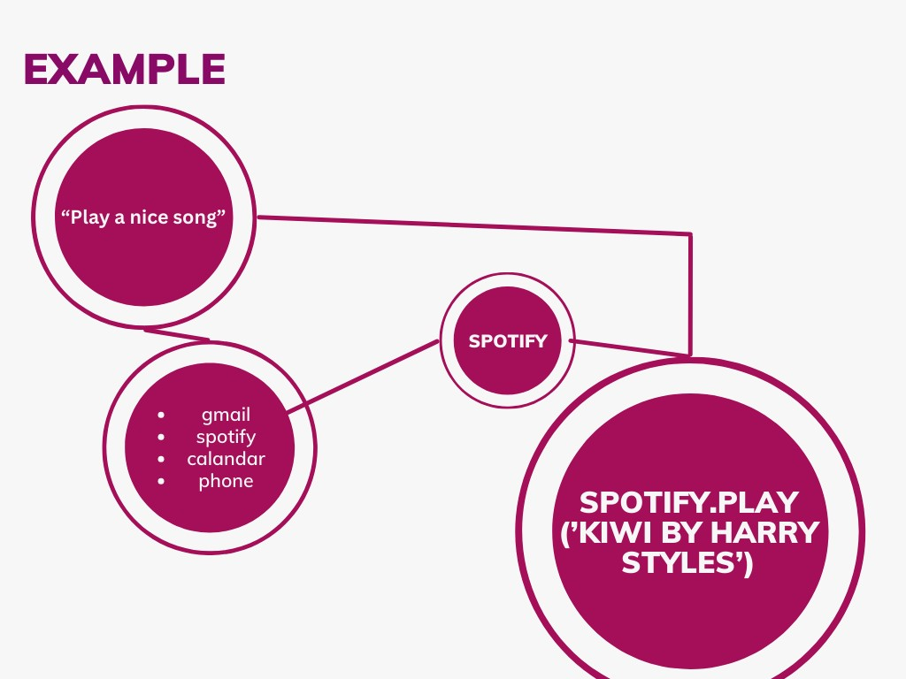

# Better than Agents: Smart Python Function Router


### We need smarter tools, not smarter ways of figuring out which tools to use.

This project showcases a smart router for Python functions using spaCy for natural language processing and GPT-3.5 for intelligent function calling.
I think this can be better than using many agents for most tasks (but not all!).

It doesn't make sense to use complex (and time consuming) chain-of-thought agents for everything.
# Quick Version:
### Here is how Agents work (according to LangChain)
(source: https://python.langchain.com/docs/use_cases/more/agents/)

### Here is how Smart Functions can work




This is a small example, and its aim is mostly to change peoples minds. But hopefully it is also usefull!
## Key Features

- Router class routes text queries to functions based on registered phrases
- smart_function decorator leverages GPT-3.5 to map queries to function calls   
- Avoid complex virtual agents - route queries directly to functions
- Saves tons of time, you don't want to have to wait 10 seconds for an AI to respond.
## Why?

Many projects try to build virtual assistants or agents that map natural language queries to specific tasks. This requires a lot of overhead in training and maintaining complex models. 
Mostly, using LLMs to determine which path to go down, is wastefull and takes time. So much latency!

90% of that can be solved with traditional nlp.
What can't be sovled using traditional nlp is populating the function calls with the correct or creative arguments.
For example, if the user asks for "nice music", nlp can determine to play a song, but it can't determine which song to play.
LLMs can. In this case the query "play some nice music", will quickly be routed to the "play_music(song_name)" function.
Then we can use an LLM to generate a song name like, "Never Gonna Give You Up by Rick Astly"
This is MUCH faster than using OpenAI's function calling or any other agent techniques. If the query is too complex, you can always revert back to agents as a last-case scenario.
This router shows a simpler method:

- Use spaCy for basic NLP routing of queries  
- Leverage GPT-3.5's few-shot learning for dynamic function calling

SpaCy handles basic routing of queries based on registered phrases like "weather in city". GPT-3.5 handles actually calling the correct function with the right arguments based on the query.

## Usage

1. Internally, SpaCy routes the query to get_weather() based on registered phrase
2. smart_function uses GPT-3.5 to call weather('Paris')
```python
from Smarter.router import Router
from Smarter.smarter import smart_function

router = Router()
@smart_function
def weather(location): # best to keep these functions to only a few lines, so call other functions within them
  """Some info for the llm to know here"""  
  # Get weather at location
  print("woot! we have a location, ", location)
  
@router.route(["weather in city"])
def get_weather(text):
  # Get weather in given city
  weather(text)

router.query_and_call("What's the weather in Paris today?")
```
## Smart Function usage
### Define a smart function
```python
@smart_function
def weather(location): # best to keep these functions to only a few lines, so call other functions within them
  """Some info for the llm to know here"""  
  # Get weather at location
  print("woot! we have a location, ", location)
```
### Use a smart function
```python
weather(query="Can you show me the weather somewhere humid?")
```
* Note: Some work needs to be done with the prompts used to ensure this is consistant, however it seems better already than LangChain's frequent "ParsingErrors" which occur every time an agent outputs something vaguely unexpected.

The LLM will then call the original (undecorated) `weather` function like this:
`weather(location="Chiang Mai, Thailand")` It automatically filled in a humid location!

No complex training or agents needed!

See example.py for more details.  

## Installation

    pip install spacy openai
    git clone (this repo)

## Advanced Usage
- The astrix, you may add an astrix before a word to emphasize importance
  - `@router.route(["play **song by`])` As you can see you can also add multiple *'s
- Brackets (POS tagging):
  - `@router.route(["play **song by [Taylor Swift]"])` This will replace Taylor Swift with a Parts of Speech tag.
  - If another artist is named "Harry Styles" for example, it will still trigger as being similar to Taylor Swift as
  - both are names. This works for most types of words, [Google] = "Amazon"
- Custom thresholds
  - `router.query_and_call("something", thresh=.5)` experiment with this.
- Put the LLM output back through the route.
  - `router.query_and_call("As a language model...", thresh=.19)` Notice how the thresh is lower because the output of the LLM is longer than the input of a user.
## Reference

See router.py and smarter.py for implementation details.

## License  

MIT

### Buy Me a Coffee?
Hey, I'm pretty broke but I'm making these things for free, if you want
feel free to buy me a coffee :)
https://www.buymeacoffee.com/danieljlosey